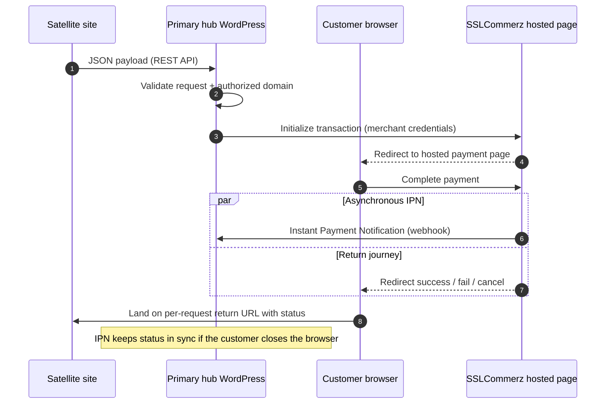

# SSLCommerz Remote: Multi-Domain Payment Gateway Bridge

## 🚀 The Challenge: The "Single Domain" Constraint
Many payment aggregators, specifically **SSLCommerz**, bind a merchant account to a single verified domain. This presents a massive scalability issue for business owners who operate multiple platforms (E-commerce stores, LMS, SaaS) but only possess a single verified merchant identity.

**The Problem:** How do you accept payments on `site-b.com` and `site-c.com` when your gateway is locked to `main-site.com`?

## 💡 The Solution: Centralized Gateway Architecture
This plugin transforms a primary WordPress installation into a **Centralized Payment Hub**. By acting as a secure "Middleware" or "Proxy," it allows any number of external platforms to "borrow" the primary site's SSLCommerz credentials.

### How it works:
1.  **Satellite Sites** (WooCommerce, Custom Apps, etc.) send a JSON payload to the **Primary Hub** via a secure REST API endpoint.
2.  The **Primary Hub** validates the request and initializes the transaction with SSLCommerz.
3.  The user completes the payment on the official SSLCommerz hosted page.
4.  The **Hub** captures the IPN (Instant Payment Notification) and securely redirects the user back to the originating **Satellite Site** with the transaction status.

### 🗺️ Architecture diagram

## 🛠 Technical Highlights
*   **API-Driven Logic:** Built using the WordPress REST API to allow headless integration.
*   **Platform Agnostic:** While built as a WP plugin, the receiving endpoint can handle requests from any framework (Laravel, React, Django, etc.).
*   **Security:** Implements request validation to ensure only authorized satellite domains can trigger the gateway.
*   **Dynamic Redirects:** Intelligent handling of `success`, `fail`, and `cancel` return URLs across different root domains.

## ⚙️ Key Features
*   **Zero-Conflict Integration:** Enables payment processing for sites that don't meet SSLCommerz's domain verification requirements yet.
*   **Unified Dashboard:** Manage and view transactions from all satellite sites in one central WordPress admin panel.
*   **Custom Success/Failure Routes:** Each request can define where the user returns, allowing for tailored user experiences per site.
*   **WebHook Support:** Robust IPN handling to ensure payment status is synchronized even if the user closes their browser.

## 🛠 Tech Stack
*   **PHP** (Logic and SSLCommerz API Implementation)
*   **WordPress Hook System** (Custom Settings Pages and Menu)
*   **REST API** (Integration Bridge)
*   **CURL / Guzzle** (For server-to-server communication)

## 📦 Installation & Setup
1.  **Download:** Clone this repository or download the `.zip` file.
2.  **Install:** Upload the plugin folder to your primary WordPress directory `/wp-content/plugins/`.
3.  **Configure:** 
    *   Navigate to **Settings > SSLCommerz Remote**.
    *   Input your Store ID and Store Password provided by SSLCommerz.
    *   (Optional) Whitelist the URLs of your satellite sites for added security.

## 📈 Impact
*   **Cost Reduction:** Saved the client from the high cost and administrative burden of maintaining multiple merchant accounts.
*   **Centralized Accounting:** Financial data from 3+ websites are now aggregated into one database for easier bookkeeping.
*   **Faster Go-To-Market:** New sites can start accepting payments instantly by simply pointing to the Hub.

---
